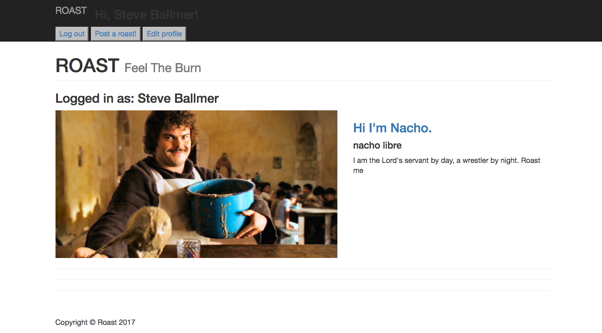

# ROAST

ROAST is a website where users can roast and be roasted for comedic purposes.

## Technologies

The languages used to build ROAST are: HTML, CSS, Ruby on Rails, AWS, Postgresql, and Bootstrap.

##Approach Taken
I have created 3 models for users, posts, and comments. Users will be able to create multiple posts and comments, while all posts and comments belong to a single user. 

After creating the models, I created all the routes, controllers, and html pages. Lastly, I implemented Amazon AWS for picture storage, Boostrap for layout, and Heroku.

##Installation/startup instructions 

Download the repository to your preferred directory.

Start a Posgres local server.

From the terminal and in your installation directory, run bundle install to install the gems.

In the terminal, create the database by running rails db:create.

Create the database tables by running rails db:migrate

In the terminal in your installation directory, run rails console to enter the rails console.

User your web browser to go to localhost:3000 to use the site locally.

##Unsolved problems and next steps.
This app has no unsolved probles, but there are next steps that I plan to work on:

* Implementing upvotes for posts and comments
* Ability to count upvotes and show in on user profiles
* Ability to reply to comments
* Better interface
*

##Trello
To visit my Trello board for this project, visit the link belo:
https://trello.com/b/EbY0OXQb
